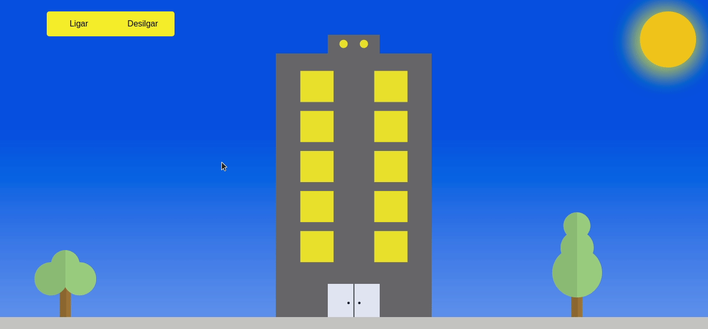

<h1 align="center">
  Desafio Aftersale
</h1>

## Projeto
Esse foi um desafio proposto pela Aftersale como teste para contratação de estagiários, o desafio consiste em codificar um edifício contendo janelas as quais, ao clique do mouse, 
deve ter sua luz acesa ou apagada. Além disso, foi necessário usar as APIs Sunset Sunrise API e a geolocation API do navegador para mudar o cenário e o estado de todas as luzes.
Porém, era necessário fazer essas implementações com React, e como ainda não abordei essa lib nos meus estudos, tive que desenvolver em HTML e JS.
<br>**Você pode consultar todos requisitos do desafio [aqui.](https://github.com/Send4BR/challenges/blob/main/front-end-estagio.md#desafio-de-est%C3%A1gio-front-end)**

## Tecnologias
- HTML
- CSS com SASS
- JavaScript

## Layout



#### Teste o projeto localmente:

```bash

    
```
